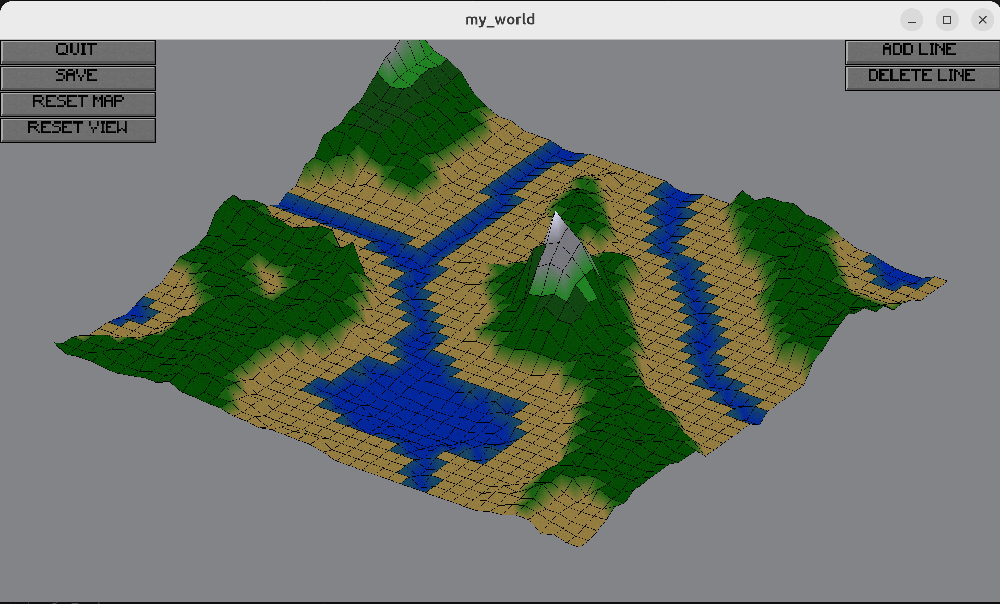

# MyWorld

This project is part of our first year of studies at [Epitech](https://www.epitech.eu). MyWorld is a 3D isometric map editor.

## Overview

Here is a preview of the project:



## Features

With this software, you can:

- Create a map by specifying its size and name
- Save your maps
- Resize the map
- View the map from every angle

## Technologies Used

- **C**: For isometric calculations, memory management...
- **CSFML**: For rendering the window and the various graphical elements

## Installation

Prerequisites: Running on Linux, CSFML installed

Clone the repository:

```bash
git clone https://github.com/Louis-dub/myworld
```

Compile the program:

```bash
make
```

Run the project:

```bash
./my_world
```

## What We Learned

- Projecting a 3D map onto a 2D screen
- Building a save system
- Displaying a 3D map from different viewpoints
